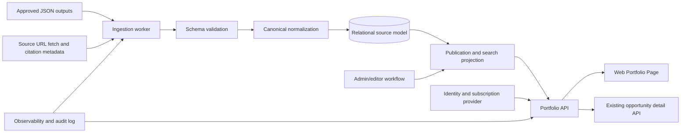
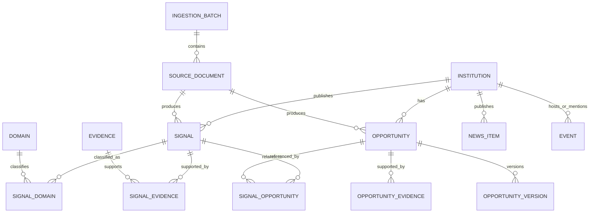

# AccountSignal Portfolio Page: Implementation Approach

## 1. Scope and design goals

The Portfolio Page is a public Financial Services intelligence surface across many institutions. It should:

- Show evidence-backed business, technology and platform signals to anonymous users.
- Let users search and filter by institution, institution type, domain, technology category and recency.
- Link a signal to a subscriber-only opportunity without exposing opportunity substance to public users.
- Scale from Citizens Financial Group to institutions such as Commerce Bank and Synovus.
- Preserve source evidence, confidence, claim-safety notes and publication history.
- Fit the existing AccountSignal account, opportunity and opportunity-detail experience.

The supplied Citizens Step 2 JSON is an intelligence input, not a page-shaped response. The Step 8A JSON is a production opportunity input and contains materially sensitive fields such as buyer mapping, sales readiness, budget sizing, scope, continuity and pursuit guidance. These are modeled and authorized separately.

## 2. Product boundary

### Public content

Public users may see:

- Institution name and institution type.
- Signal title, summary, domain, date and source category.
- High-level business implication and carefully bounded technology implication.
- Confidence label where product policy permits it.
- Public citations and source links.
- A generic related-opportunity label and subscriber-access call to action.

### Subscriber content

An authorized subscriber may additionally see:

- Opportunity classification, priority, rank and sales readiness.
- Opportunity executive summary and analysis.
- Business and technology capability context.
- Buyer map and stakeholder roles.
- Budget range, implementation window and validation requirements.
- Scope, continuity, supporting signals and pursuit guidance.

The public API must never serialize subscriber fields and rely on the browser to hide them. Entitlements are enforced in the API/service layer and, where applicable, at the database query boundary.

## 3. High-level architecture



### Recommended components

| Component | Responsibility |
|---|---|
| Portfolio web route | Renders filters, signal cards, right-rail panels and access states using existing design/navigation conventions. |
| Portfolio API | Validates query parameters, applies public/subscriber policy, returns paginated view models and filter metadata. |
| Opportunity service | Reuses the existing subscriber opportunity and opportunity-detail contract; Portfolio only references an opportunity ID. |
| Ingestion worker | Validates JSON, stores the original artifact, normalizes records, resolves identities, and creates a publishable version. |
| Relational database | System of record for institutions, signals, opportunities, evidence, taxonomy, publication status and entitlements. PostgreSQL is a suitable default if the existing platform already uses it. |
| Search projection | PostgreSQL full-text/trigram search at initial scale; OpenSearch/Azure AI Search when cross-institution volume and relevance needs justify it. |
| Object storage | Immutable copies of input JSON, validation reports and raw source artifacts. |
| Identity/billing integration | Supplies user identity, organization, subscription tier and feature entitlements. |
| Observability | Ingestion metrics, API latency, publication audit, authorization decisions and data-quality alerts. |

## 4. Database design

Use stable internal UUIDs for entities and source-system keys for reconciliation. Do not use the institution name as a primary key.



### Core tables

#### `institutions`

- `id` UUID primary key
- `canonical_name`
- `slug` unique
- `institution_type` (bank, payments, insurer, wealth, retirement, other)
- `parent_institution_id` nullable
- `status`
- `created_at`, `updated_at`

#### `domains`, `technologies`, `institution_types`

Controlled taxonomy tables with stable codes, display labels, aliases and active dates. Example domain codes include `digital_banking`, `payments`, `lending`, `wealth`, `risk_aml`, `data_ai` and `enterprise_technology`.

#### `signals`

The public-facing normalized intelligence object.

- `id` UUID primary key
- `institution_id` foreign key
- `source_document_id` foreign key
- `source_record_key` unique within source/version
- `signal_type` (business_priority, budget_logic, news, industry_theme, platform_change)
- `title`
- `public_summary`
- `public_implication`
- `claim_safety_note`
- `confidence` (high, medium, low)
- `observed_at`, `published_at`, `expires_at` nullable
- `visibility` (draft, public, retired)
- `content_hash`
- `created_at`, `updated_at`

Store public copy separately from internal analysis fields. If editorial review changes wording, the source-derived record remains auditable.

#### `signal_domains` and `signal_technologies`

Many-to-many join tables with `classification_type` (`primary`, `secondary`, `inferred`) and a confidence/ordering field.

#### `evidence`

- `id`
- `source_url`
- `source_title`
- `source_type`
- `publisher`
- `publication_date`
- `retrieved_at`
- `evidence_summary`
- `content_hash`
- `is_public`

`signal_evidence` and `opportunity_evidence` join records include `role` (primary, supporting, context) and display order.

#### `opportunities`

The subscriber object and stable identity across revisions.

- `id` UUID primary key
- `institution_id`
- `canonical_opportunity_key` (for example, the normalized `citizens_opp_2`)
- `current_version_id`
- `visibility` (subscriber, internal, retired)
- `created_at`, `updated_at`

#### `opportunity_versions`

Version every material Step 8A load rather than overwriting history.

- `id`, `opportunity_id`, `source_document_id`
- `opportunity_title`, `classification`, `priority`, `rank`, `sales_readiness`
- `executive_summary`, `analysis_jsonb`
- `business_context_jsonb`, `technology_context_jsonb`
- `buyer_map_jsonb`, `scope_jsonb`, `budget_jsonb`, `implementation_window_jsonb`
- `continuity_jsonb`
- `effective_at`, `superseded_at`
- `content_hash`, `validation_status`

JSONB is appropriate for source-shaped, evolving nested structures such as buyer maps and continuity, while searchable/filterable fields remain typed columns. The API maps this into a stable response DTO rather than exposing raw JSON.

#### `signal_opportunities`

- `signal_id`
- `opportunity_id`
- `relationship_type` (related, moved_to_confirmed, new_evidence, same_theme)
- `public_label`
- `subscriber_label`
- `display_order`

The public projection uses only `public_label` and the fact that subscriber intelligence exists.

#### `news_items` and `events`

Right-rail content should have first-class records, not be embedded in a signal response. Both support institution/domain tags, source evidence, publication date, visibility and expiration. This permits independent editorial updates and pagination.

#### `source_documents` and `ingestion_batches`

`source_documents` stores input URI, artifact hash, source type, schema version, received time and validation result. `ingestion_batches` tracks status, counts, errors, actor and deployment version. A unique artifact hash makes replays idempotent.

#### `subscriptions`, `entitlements`, `audit_events`

Subscriptions map organizations/users to product entitlements such as `portfolio_public`, `opportunity_read` and `opportunity_detail`. Audit events record publication changes, ingestion actions and denied access without storing unnecessary sensitive request data.

### Important indexes

- `institutions(slug)` unique.
- `signals(visibility, published_at desc)`.
- `signals(institution_id, published_at desc)`.
- `signal_domains(domain_id, signal_id)`.
- `opportunities(institution_id, visibility, updated_at desc)`.
- Full-text index over public signal title/summary/implication, with trigram indexes for institution and technology aliases.
- Partial indexes limited to `visibility = 'public'` for anonymous traffic.

## 5. Ingestion and publishing approach

### Pipeline

1. **Receive**: Accept JSON from a controlled bucket or authenticated upload endpoint. Store the immutable original artifact and SHA-256 hash.
2. **Validate envelope**: Check file type, size, malware policy, JSON syntax, required metadata and allowed `output_type`/`step_name` values.
3. **Validate schema**: Use versioned JSON Schema. Reject missing identity, malformed citations, invalid confidence values and unsupported taxonomy values. Unknown fields are retained in the raw artifact and reported, not silently discarded.
4. **Normalize identities**: Resolve `bank_name`/`institution_name` to an institution ID using canonical names and reviewed aliases. A new institution goes to a quarantine queue rather than being auto-created from an untrusted spelling.
5. **Normalize records**: Convert executive readouts, priorities, budget-release themes and granular signal objects into `signals`; convert Step 8A sales plays into `opportunities` and version rows.
6. **Resolve relationships**: Match opportunities by institution plus stable `opportunity_id`. Match signals to opportunities using explicit source references first, then reviewed relationship rules. Never infer a subscriber relationship solely from matching words.
7. **Upsert idempotently**: Use `(source_document_id, source_record_key)` and content hashes. Replaying an unchanged artifact produces no duplicate public records.
8. **Run quality checks**: Check citation presence, public wording rules, duplicate titles, domain taxonomy, orphaned opportunity references, date recency and sensitive-field leakage.
9. **Review and publish**: Load into staging tables, then atomically promote approved records to the read projection. Publish status is separate from ingestion success.
10. **Report**: Emit batch counts, rejected records, changed records and a link to the validation report. Alert on unusual volume changes or a drop in citation coverage.

### Update semantics

- New evidence creates a new signal version or new signal, depending on product identity rules.
- A changed business priority updates the current signal only after review; prior wording remains in history.
- An unchanged opportunity keeps its canonical opportunity ID and receives a new version.
- Step 8A continuity fields are copied as source data and never recomputed by the Portfolio ingestion job.
- Retired records are soft-retired so old citations and audit trails remain valid.

## 6. API and page contract

Use cursor pagination for the feed. Return a server-generated `next_cursor`, not page-number offsets, because new weekly signals can otherwise shift results while a user browses.

### Public portfolio endpoint

`GET /api/v1/portfolio/signals`

Query parameters:

- `q`: institution, domain, technology or signal text
- `institution`: repeated institution slugs
- `institutionType`
- `domain`
- `technology`
- `since` / `until` or a named range such as `30d`
- `cursor`
- `limit` with a server maximum
- `sort=recent|relevance`

Response shape:

```json
{
  "items": [
    {
      "id": "signal-id",
      "institution": { "name": "Citizens", "slug": "citizens", "type": "bank" },
      "domain": { "code": "enterprise_technology", "label": "Enterprise Technology" },
      "title": "Application and supplier simplification remains central to Reimagine",
      "summary": "Efficiency commitments support rationalization and service-boundary decisions.",
      "observedAt": "2026-09-24",
      "sourceLabel": "Investor materials and management priorities",
      "confidence": "high",
      "relatedOpportunity": {
        "hasSubscriberIntelligence": true,
        "publicLabel": "Subscriber intelligence"
      }
    }
  ],
  "nextCursor": "...",
  "facets": {
    "domains": [],
    "institutionTypes": [],
    "institutions": []
  },
  "updatedAt": "2026-09-26T00:00:00Z"
}
```

### Subscriber opportunity endpoint

`GET /api/v1/portfolio/signals/{signalId}/opportunity`

The service checks the entitlement before loading or serializing the opportunity version. Without access, return a stable `403`/product access response that contains no title, budget, buyer or scope data. With access, return a DTO compatible with the existing opportunity-detail experience.

### Supporting endpoints

- `GET /api/v1/portfolio/summary`: counts for “new signals this week” and “opportunity classifications changed”.
- `GET /api/v1/portfolio/news`: institution and industry news rail.
- `GET /api/v1/portfolio/events`: upcoming event rail.
- `GET /api/v1/portfolio/filters`: cached taxonomy and available facet values.
- Existing account/opportunity endpoints remain the authority for subscriber detail pages.

### Frontend composition

Implement the page as independently testable components:

- `PortfolioHeader`: title, update summary and access messaging.
- `PortfolioFilters`: debounced search, select filters and URL-synchronized state.
- `SignalFeed`: cursor loading, empty state, error state and accessible card list.
- `SignalCard`: public evidence with entitlement-aware related-opportunity CTA.
- `NewsRail`, `IndustryRail`, `EventsRail`.
- `SubscriberAccessBanner`.

Filters should be encoded in the URL so a public result can be bookmarked and shared. Use server-side rendering or initial data loading if the existing application supports it, then hydrate for filter changes. Do not prefetch subscriber detail for anonymous users.

## 7. Development approach in the existing application

1. **Reconnaissance**: Identify the current frontend route/layout, design tokens, authentication/entitlement middleware, opportunity DTOs and database migration framework. Reuse these boundaries.
2. **Contract first**: Add OpenAPI schemas and fixture responses for public and subscriber users before page implementation.
3. **Data foundation**: Add migrations, taxonomy seed data, ingestion validation and a Citizens fixture load. Keep raw and normalized fixtures in tests, not production.
4. **Read model**: Implement the public signal query, facet query and cursor pagination. Add authorization tests before wiring the UI.
5. **Page slice**: Build header, filters, signal cards and access banner against the fixture API. Add right-rail APIs/components separately.
6. **Integration**: Connect `signal_opportunities` to the existing opportunity service. Reuse its subscriber detail route and avoid duplicating opportunity business rules.
7. **Editorial workflow**: Add review/publish status and validation reports before enabling automated production publication.
8. **Hardening**: Add accessibility, performance, observability, security and content-leakage tests.

## 8. Dev -> QA -> Production

### Environments

- **Development**: Local database/object storage emulator, sanitized Citizens fixture, seeded test identities and a feature flag for the new route.
- **QA**: Production-like database/search configuration, representative multi-institution fixtures, SSO/subscription test tenants and synthetic load tests.
- **Production**: Managed database with backups and point-in-time recovery, private object storage, centralized secrets, monitoring and controlled ingestion schedules.

### Release sequence

1. Deploy additive migrations and new code with the page disabled.
2. Run schema validation, migration checks, backfill into staging/read projections and leakage scans.
3. Enable internal users, then a small subscriber cohort, then public traffic behind a feature flag.
4. Compare API latency, error rates, search quality, citation coverage and page engagement.
5. Expand rollout after the agreed acceptance thresholds are met.

### Testing

- JSON Schema contract tests for every supported input version.
- Unit tests for normalization, identity resolution, relationship mapping and date filters.
- API tests for pagination, facets, search, public response allowlists and entitlement denial.
- Snapshot/contract tests for existing opportunity-detail compatibility.
- Browser tests for keyboard navigation, responsive layout, filter URL state, empty/error states and subscriber CTA behavior.
- Security tests for IDOR, authorization bypass, raw JSON exposure, injection and rate limits.
- Load tests for anonymous feed traffic and concurrent subscriber requests.
- Accessibility checks targeting WCAG 2.2 AA.

### Migration and rollback

Migrations are additive first: tables, indexes and nullable columns precede code that depends on them. Backfills run in batches and are restartable. Publication uses a versioned read projection so a bad batch can be unpublished or the previous projection can be restored without deleting source history. Code rollback is safe because old code continues to work with the additive schema. Destructive changes require a separate deprecation release.

## 9. Key technical decisions and assumptions

- **Relational system of record**: Relationships, entitlement boundaries, version history and auditability are central; a document-only store would make these harder to enforce.
- **JSONB at the edge, typed columns at the query path**: Preserve evolving intelligence structures without sacrificing filter/index performance.
- **Separate public and subscriber DTOs**: An allowlist is easier to review and test than field-by-field redaction of a large opportunity object.
- **Explicit publication state**: A valid ingestion is not automatically publishable; editorial and claim-safety review remain possible.
- **Stable identity plus versioning**: Opportunity continuity depends on preserving canonical IDs across source refreshes.
- **Search starts in PostgreSQL**: Add a dedicated search engine when volume, relevance tuning or cross-field search exceeds database capabilities; keep the relational model authoritative.
- **Caching**: Cache anonymous filter metadata and common public query results for a short TTL. Do not share cached subscriber responses across users or tenants.
- **Security**: Encrypt data in transit and at rest, use least-privilege ingestion credentials, keep secrets outside JSON, and log access decisions without logging sensitive opportunity payloads.
- **Scale assumption**: The initial design supports thousands of institutions and millions of signals with partitioning/archive options by publication date if needed. The API remains stateless and horizontally scalable.
- **Content assumption**: Public wording is deliberately narrower than internal intelligence. Vendor, funding, procurement and implementation claims require explicit evidence and should not be generated from category-level indicators alone.
- **Reference limitation**: The supplied mockup is the visual contract. The existing DOCX/XLSX should be used during implementation to reconcile exact legacy field names and screen behavior, but they should not dictate the new normalized public API.

## 10. Definition of done

The feature is ready for production when:

- Citizens, Commerce Bank and Synovus fixtures render through the same institution-agnostic code path.
- Anonymous users can search/filter public signals and cannot retrieve subscriber opportunity fields.
- Authorized subscribers can move from a related signal into the existing opportunity-detail experience.
- Every public signal has traceable evidence and an auditable publication version.
- Replaying the same JSON is idempotent; a changed JSON produces a reviewable version diff.
- Migration rollback, ingestion quarantine, monitoring and feature-flag disablement have been exercised in QA.
- Performance, accessibility and authorization test thresholds are met.
